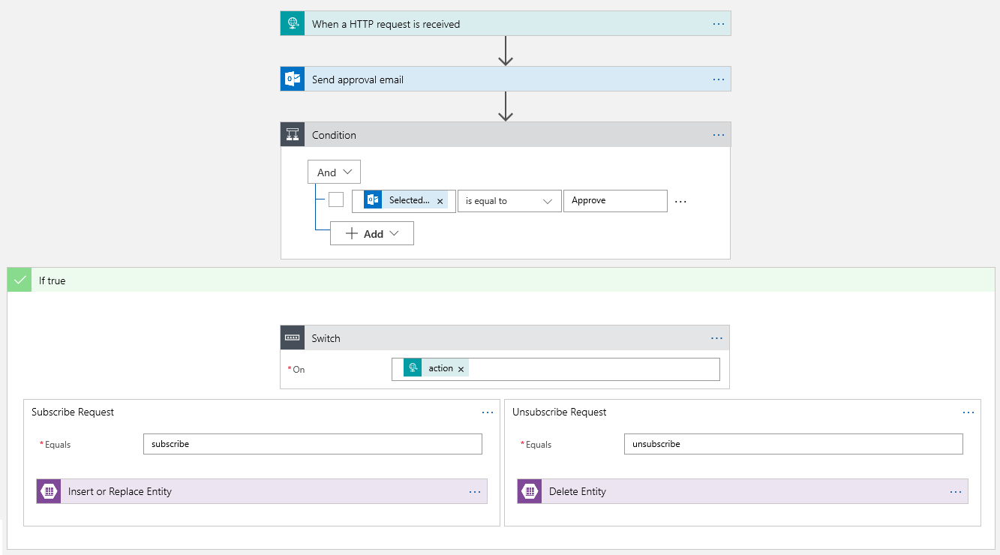
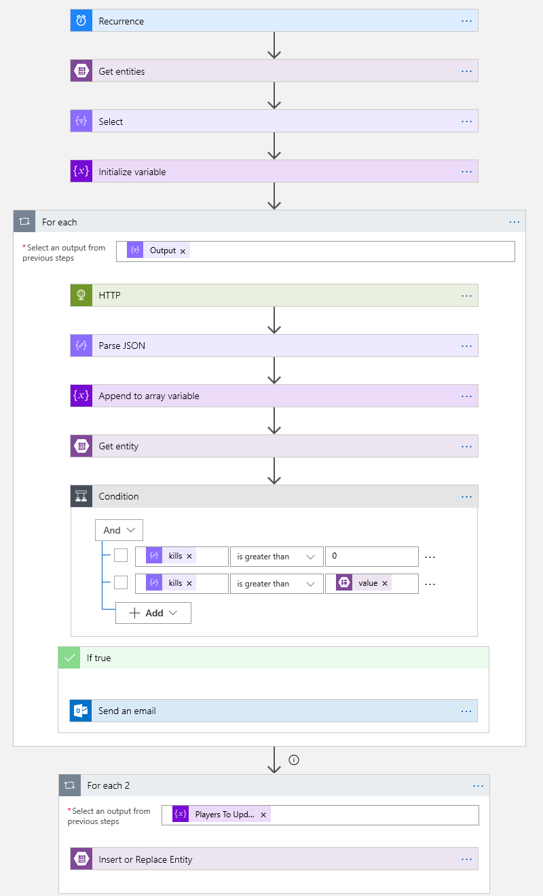

# Subscribing to Fortnite Statistics using Azure Logic Apps
#### Gage Ames (gage@gageames.com)
A tutorial for using [Azure Logic Apps](https://azure.microsoft.com/services/logic-apps/) to monitor Fortnite statistics using the data provided by [Fortnite Tracker](https://fortnitetracker.com). The app sends an email notification to subscribers when a player's statistics change.

## Technologies Used
- [Azure Logic Apps](https://azure.microsoft.com/services/logic-apps/) - Manage subscriptions, monitor player statistics, and send email notifications to subscribers
- [Azure Table Storage](https://azure.microsoft.com/services/storage/tables/) - Stores persistent data like subscribers and cached player statistics

## Prerequisites
- An Azure subscription
  - If you don't have one, [sign up for free](https://azure.microsoft.com/free/).
  - If you're a student, you can [sign up for free](https://azure.microsoft.com/free/students) without requiring a credit card at sign-up.
- An email account (Office 365 or Outlook for all features, Gmail if approval emails are not required)
- A web browser
- [Azure Storage Explorer](https://azure.microsoft.com/features/storage-explorer/) (optional, but recommended for working with Azure Table Storage)

## Create Azure resources
Logics Apps allow you to build and test your application entirely from the Azure Portal using the Logic Apps Designer. Let's get started by creating a few Logic Apps and a storage account.

### Sign in to the Azure portal
1. Go to the [Azure portal](https://portal.azure.com) and sign in with your Azure account credentials.
    > See [Prerequisites](#prerequisites) for sign up links if you don't have an account

### Create a Logic App to manage subscribers
1. From the main Azure menu, choose **Create a resource** > **Web** > **Logic App**.
1. Provide details about your Logic App as shown here. 
After you're done, choose **Create**.

    | Property | Value | Description |
    |----------|-------|-------------|
    | **Name** | FortniteSubscriptionManager | The name for your Logic App | 
    | **Subscription** | <*your-Azure-subscription-name*> | The name for your Azure subscription |
    | **Resource group** | Create new > FortniteLogicAppSample | The name for the [Azure resource group](https://docs.microsoft.com/azure/azure-resource-manager/resource-group-overview) used to organize related resources |
    | **Location** | East US | The region where to store your Logic App information |
    | **Log Analytics** | Off | Keep the **Off** setting for diagnostic logging. |

### Create a Logic App to monitor Fortnite player statistics
1. From the main Azure menu, choose **Create a resource** > **Web** > **Logic App**.
1. Provide details about your Logic App as shown here. 
After you're done, choose **Create**.

    | Property | Value | Description |
    |----------|-------|-------------|
    | **Name** | FortniteNotifier | The name for your Logic App | 
    | **Subscription** | <*your-Azure-subscription-name*> | The name for your Azure subscription |
    | **Resource group** | Use existing > FortniteLogicAppSample | Use the same resource group as the Logic App |
    | **Location** | East US | The region where to store your Logic App information |
    | **Log Analytics** | Off | Keep the **Off** setting for diagnostic logging. |

### Create a Storage Account
1. From the main Azure menu, choose **Create a resource** > **Storage** > **Storage account - blob, file, table, queue**.
1. Provide details about your Storage Account as shown here. 
After you're done, choose **Create**.

    | Property | Value | Description |
    |----------|-------|-------------|
    | **Name** | <*your-name*>fortnitedata | The name for your Storage Account | 
    | **Deployment model** | Storage (general purpose v1) | The type of storage account. V1 has everything we need. |
    | **Account kind** | Resource manager | Use Resource Manager for new applications and for the latest Azure features |
    | **Location** | East US | The region where to store your app's data |
    | **Replication** | Locally-redundant storage (LRS) | The least durable but lowest cost storage |
    | **Performance** | Standard | Standard storage accounts are backed by magnetic drives and provide the lowest cost per GB |
    | **Secure transfer required** | Enabled | There's no reason not to use HTTPS |
    | **Subscription** | <*your-Azure-subscription-name*> | The name for your Azure subscription |
    | **Resource group** | Use existing > FortniteLogicAppSample | Use the same resource group as the Logic App |
    | **Log Analytics** | Off | Keep the **Off** setting for diagnostic logging. |

### Create tables in the storage account
Azure Table Storage will be used to persist data about subscribers and player statistics between executions of the Logic App.
1. From the main Azure menu, choose **Resource groups** > **FortniteLogicAppSample**.
1. Choose the **<*your-name*>fortnitedata** Storage Account that was created earlier.
1. The storage account overview will open. Under **Services** choose **Tables**.
1. Click the **+ Table** button at the top to add a new table named **subscriptions** and choose **OK**.
1. Click the **+ Table** button again to add a new table named **playerstats** and choose **OK**.

## Configure the FortniteSubscriptionManager Logic App
This Logic App will accept subscribe and unsubscribe requests from users to/from a Fortnite player of their choosing. It will also verify the request was intentional by sending a verification email to the user prior to honoring their request.



### Configure the trigger for the FortniteSubscriptionManager Logic App
Every Logic App must start with a trigger, which fires when a specific event happens or when a specific condition is met. Each time the trigger fires, the Logic Apps engine creates a Logic App instance that starts and runs your workflow.
1. From the main Azure menu, choose **Resource groups** > **FortniteLogicAppSample**.
1. Choose the **FortniteSubscriptionManager** Logic App that was created earlier.
1. The Logic Apps Designer will open and show a page 
with an introduction video and commonly used triggers. Under **Start with a common trigger**, choose **When a HTTP request is received**.
1. Use the **Save** button at the top of the screen to save the Logic App. Notice that a unique URL to trigger your Logic App was populated in the **HTTP POST URL** box. Your Logic App workflow will be triggered when a `POST` request is received at this URL.

### Configure the parameters for the HTTP trigger
Your Logic App will need some information from the user to subscribe/unsubscribe them to/from a player's statistics. Namely, we'll need the email address of the subscriber, the username of the player, and whether the request is to subscribe or unsubscribe.
1. In the **When a HTTP request is received** trigger, click the **Edit** link next to **Using the default values for the parameters**. In the box that appears, we'll provide a JSON schema of the request format our Logic App should expect.
    1. Under the **Request Body JSON Schema** box, click the **Use sample payload to generate schema** link.
    1. In the **Enter or paste a sample JSON payload** dialog, paste the JSON below.
        ```json
        {
          "action": "subscribe",
          "email": "example@example.com",
          "player": "p0k1m4n3"
        }
        ```
    1. Choose **Done**.
1. Click the **&middot;&middot;&middot;** menu on the right side of the **When a HTTP request is received** trigger.
    1. Choose **Settings** from the menu.
    1. Toggle the **Schema Validation** setting to **On**. This will ensure only requests that match the schema are processed by the Logic App.
    1. Choose **Done**.
1. Save the Logic App.

### Send an approval email to validate the request
1. Choose **+ New step** in the Logic Apps Designer.
1. Under **Choose an action**, enter "send approval email" as your filter. From the actions list, select the **Send approval email** action for the email provider that you want.
    1. To filter the actions list to a specific app or service, you can select that app or service first:
        * For personal Microsoft accounts, select **Outlook.com**.
        * For Office 365 work or school accounts, select **Office 365 Outlook**.
        > The Gmail service does not support sending approval emails. If you only have a Gmail account, you can still use the **Send an email** action but your Logic App will not be able to receive responses to the email.
1. If asked for credentials, sign in to your email account so that Logic Apps can create a connection to your email account.
1. In the **Send approval email** action, specify the data that you want the email to include.
    1. Click inside the **To** box. The dynamic content dialog will appear. Choose **email** from the **Dynamic content** tab under the **When a HTTP request is received** heading. This will use the email address provided in the body of the HTTP request that triggered the workflow.
    1. If you like, edit the **Subject** of the email. You can include other parameters from the HTTP request using the dynamic content dialog. For example, you may want to change the subject to "Please approve <*action*> request for <*player*>'s Fortnite stats" where the <*action*> and <*player*> strings are replaced with the parameter values from the HTTP request.
1. Save the Logic App.

### Check if the request was approved
After the approval email is sent, the Logic App will wait for the user to click either the "Approve" or "Reject" link in the email. Once the user clicks one of those links, the Logic App will need to determine what to do next based on the response.
1. Choose **+ New step** in the Logic Apps Designer.
1. Under **Choose an action**, enter "condition" as your filter. From the actions list, choose the **Condition** Control action.
1. In the **Condition** action, populate the tree of conditions to evaluate.
    1. Leave the **And** drop down as is.
    1. Click inside the **Choose a value** box. The dynamic content dialog will appear. Choose **SelectedOption** from the **Dynamic content** tab under the **Send approval email** heading.
    1. Leave the value of the **is equal to** condition unchanged.
    1. In the **Choose a value** box, enter **Approve**.
1. Save the Logic App.

### Check if the request was for subscribing or unsubscribing
Once the request is approved the Logic App will need to perform the requested action (subscribe or unsubscribe the user). In this step, we'll determine which action to perform.
1. Choose **Add an action** within the **If true** block below the **Condition** in the Logic Apps Designer.
1. Under **Choose an action**, enter "switch" as your filter. From the actions list, choose the **Switch** Control action.
1. In the **Switch** action, populate the **On** value to tell the control action what value should be used to determine the next step.
    1. Click inside the **On** box. The dynamic content dialog will appear. Choose **action** from the **Dynamic content** tab under the **When a HTTP request is received** heading.
1. Below the **Switch** action, locate the **Case** block. Populate the **Equals** box with the text `subscribe`.
1. Click the **(+)** button between the **Case** block and the **Default** block. A **Case 2** block will be added.
1. Inside the **Case 2** block, populate the **Equals** box with the text `unsubscribe`.
> If you like, you can rename these case blocks using the **Rename** option within the **&middot;&middot;&middot;** menu of each block.
1. Save the Logic App.

### Add an entry to the subscriptions table if the request was to subscribe
1. Choose **Add an action** within the **Case** block containing "Equals subscribe."
1. Under **Choose an action**, enter "insert or replace" as your filter. From the actions list, choose the **Insert or Replace Entity** Azure Table Storage action.
1. In the **Insert or Replace Entity** action, specify the table and the entity to insert or replace.
    1. You may be prompted for a Storage Account connection
        1. In the **Connection Name** box, provide a name like **FortniteLogicAppStorage**.
        1. Choose the **Storage Account** created earlier, **<*your-name*>fortnitedata**.
        1. Click **Create**.
    1. Once the connection is created, choose **subscriptions** from the **Table** drop down.
    1. Click inside the **Partition Key** box. The dynamic content dialog will appear. Choose **player** from the **Dynamic content** tab under the **When a HTTP request is received** heading.
    1. Click inside the **Row Key** box. The dynamic content dialog will appear. Choose **email** from the **Dynamic content** tab under the **When a HTTP request is received** heading.
    1. In the **Entity** box, enter the JSON below.
        ```json
        {
          "Timestamp": null
        }
        ```
        > The `Timestamp` property of the entity is automatically set by Azure when it inserts or replaces the table entity. Any value we provide would be ignored, so `null` is fine here.
1. Save the Logic App.

### Remove an entry from the subscriptions table if the request was to unsubscribe
1. Choose **Add an action** within the **Case 2** block containing "Equals unsubscribe."
1. Under **Choose an action**, enter "delete entity" as your filter. From the actions list, choose the **Delete Entity** Azure Table Storage action.
1. In the **Delete Entity** action, specify the table and the entity to delete.
    1. Choose **subscriptions** from the **Table** drop down.
    1. Click inside the **Partition Key** box. The dynamic content dialog will appear. Choose **player** from the **Dynamic content** tab under the **When a HTTP request is received** heading.
    1. Click inside the **Row Key** box. The dynamic content dialog will appear. Choose **email** from the **Dynamic content** tab under the **When a HTTP request is received** heading.
    1. Leave the **ETag** box empty.
1. Save the Logic App.

### Test out the FortniteSubscriptionManager Logic App
Congratulations! The Logic App should now be ready for use. Let's test it out!
1. Save any outstanding changes made to the Logic App using the **Save** button at the top of the Logic Apps Designer.
1. Click the **When a HTTP request is received** trigger to expand it. Copy the value of the **HTTP POST URL** using the **Copy URL** button. Store this for later use.
1. Make a HTTP `POST` request to the URL copied in the last step.
    * On Windows, this can be done using a PowerShell command like this:
        ```PowerShell
        Invoke-RestMethod -Method Post -Body (@{ "action" = "subscribe"; "email" = "example@example.com"; "player" = "Ninja" } | ConvertTo-Json) -ContentType "application/json" -Uri "the-url-of-your-logic-app"
        ```
    * On Mac/Linux/Windows Subsystem for Linux, this can be done using a cURL command like this:
        ```bash
        curl --request POST --data '{"action":"subscribe","email":"example@example.com","player":"ValkyraeXD"}' --header "Content-Type: application/json" "the-url-of-your-logic-app"
        ```
1. Close the Logic Apps Designer using the **X** in the top right corner of the blade.
1. Choose  **Refresh**  at the top of the Logic App overview blade.
1. Under the  **Run history** section of the Logic App overview blade, find the most recent run of the Logic App. Click its row to view a visualization of the executed workflow.
1. Optionally, use [Azure Storage Explorer](https://azure.microsoft.com/features/storage-explorer/) to browse to the <*your-name*>fortnitedata Storage Account and verify an entity was added to the **subscriptions** table.

## Configure the FortniteNotifier Logic App
This Logic App will periodically query statistics from a [Fortnite Tracker](https://fortnitetracker.com) API based on the subscriptions in the Azure Table and inform subscribers of changes in these statistics via email.



### Configure the trigger for the FortniteNotifier Logic App
This Logic App's trigger will be a recurrence, meaning the Logic App will execute itself automatically based on a configurable time interval.
1. From the main Azure menu, choose **Resource groups** > **FortniteLogicAppSample**.
1. Choose the **FortniteNotifier** Logic App that was created earlier.
1. The Logic Apps Designer will open and show a page 
with an introduction video and commonly used triggers. Under **Start with a common trigger**, choose **Recurrence**.
1. Keep the default recurrence frequency or update it if you like.
1. Use the **Save** button at the top of the screen to save the Logic App. If you chose a frequent interval for the Logic App, you may wish to return to the Logic App's overview blade and disable the Logic App until it is complete.

### Read subscriptions from the Table Storage
The **subscriptions** table will store a mapping between Fortnite player names and the email addresses that should be notified when the player's statistics change.
1. Choose **+ New step** in the Logic Apps Designer.
1. Under **Choose an action**, enter "get entities" as your filter. From the actions list, select the **Get entities** Azure Table Storage action.
1. In the **Get entities** action, specify the details of **subscriptions** table created earlier.
    1. You may be prompted for a Storage Account connection
        1. In the **Connection Name** box, provide a name like **FortniteLogicAppStorage**.
        1. Choose the **Storage Account** created earlier, **<*your-name*>fortnitedata**.
        1. Click **Create**.
    1. Once the connection is created, choose **subscriptions** from the **Table** drop down.
1. Save the Logic App.

### Select the subscription details from the entities
1. Choose **+ New step** in the Logic Apps Designer.
1. Under **Choose an action**, enter "select" as your filter. From the actions list, choose the **Select** Data Operations action.
1. In the **Select** action, specify the properties to select from the table entities.
    1. Click inside the **From** box. The dynamic content dialog will appear. Choose **Get entities result List of Entities** from the **Dynamic content** tab.
    1. In the **Map** fields, enter the following mappings

        | Key | Value | Details |
        |-----|-------|---------|
        | **Player** | **Get entities result An entity Partition Key** | Choose this value from the **Dynamic content** tab |
        | **Subscriber Email** | **Get entities result An entity Row Key** | Choose this value from the **Dynamic content** tab |

1. Save the Logic App.

### Create a variable to store player statistics
1. Choose **+ New step** in the Logic Apps Designer.
1. Under **Choose an action**, enter "initialize variable" as your filter. From the actions list, choose the **Initialize variable** Variables action.
1. In the **Initialize variable** action, specify the name and type of the variable.
    1. In the **Name** box, provide a name like **Players to Update**.
    1. In the **Type** box, choose **Array** from the drop down.
    1. Leave the **Value** box empty.
1. Save the Logic App.

### Create a loop to iterate through the subscriptions
1. Choose **+ New step** in the Logic Apps Designer.
1. Under **Choose an action**, enter "for each" as your filter. From the actions list, choose the **For each** Control action.
1. In the **For each** action, specify the output of the **Select** action as the value for the **Select an output from previous steps** box. Click within the box and choose **Output** under the **Select** step header of the **Dynamic content** tab.
1. Save the Logic App.

### Get player statistics from the Fortnite Tracker API
[FortniteTracker.com](https://fortnitetracker.com) offers an API that provides recent player statistics to power an overlay for the popular [Open Broadcaster Software](https://obsproject.com) streaming software. We'll query that API for each player within our Logic App to gather their statistics. The API is located at `https://fortnitetracker.com/profile/<platform>/<username>/obs/data/0`. For example, Ninja's would be https://fortnitetracker.com/profile/pc/Ninja/obs/data/0.
1. Choose **Add an action** within the **For each** loop in the Logic Apps Designer.
1. Under **Choose an action**, enter "http" as your filter. From the actions list, choose the **HTTP** HTTP action.
1. In the **HTTP** action, specify the properties of the API request.
    1. In the **Method** box, choose **GET** from the drop down.
    1. In the **URI** box, enter the value `https://fortnitetracker.com/profile/pc/<username>/obs/data/0`.
        1. After populating the field, highlight the `<username>` portion of the field's value and delete it. We'll replace it with a value from the **Expression** dialog
        1. With your cursor at the position where `<username>` used to be, click the **Expression** tab in the **Dynamic content** dialog.
        1. In the expression box, enter `item()['Player']` and choose **OK**. This will insert the value of the **Player** property into the URI at the correct position.
    1. Leave the remaining fields of the **HTTP** action empty.
1. Save the Logic App.

### Parse the response from the Fortnite Tracker API
1. Choose **Add an action** within the **For each** loop in the Logic Apps Designer.
1. Under **Choose an action**, enter "parse json" as your filter. From the actions list, choose the **Parse JSON** Data Operations action.
1. In the **Parse JSON** action, specify the content to parse and the schema.
    1. Click inside the **Content** box. The dynamic content dialog will appear. Choose **Body** from the **Dynamic content** tab under the **HTTP** step.
    1. Under the **Schema** box, click the **Use sample payload to generate schema** link.
    1. In the **Enter or paste a sample JSON payload** dialog, paste the JSON below.
        ```json
        {
          "overall": {
            "wins": 0
          },
          "kills": 0
        }
        ```
        > If you would like to include the entire JSON payload you may, but it contains many properties that won't be used in this tutorial.
    1. Choose **Done**.
1. Save the Logic App.

### Append the player's statistics to the Players to Update variable
This step will append the object resulting from the **Parse JSON** step to the **Players to Update** array with an additional **Player** property added. We'll need the player's name later to be able to update our cached statistics.
1. Choose **Add an action** within the **For each** loop in the Logic Apps Designer.
1. Under **Choose an action**, enter "append to array" as your filter. From the actions list, choose the **Append to array variable** Variables action.
1. In the **Append to array variable** action, specify the variable name and value to append.
    1. In the **Name** box, choose **Players to Update** from the drop down.
    1. Click inside the **Value** box. The dynamic content dialog will appear. Switch to the **Expression** tab and enter `setProperty(body('Parse_JSON'), 'Player', item()['Player'])` into the expression box. Click **OK** to set the expression as the value to append.
    > This expression takes the object resulting from the **Parse JSON** step and adds an additional **Player** property containing the player's name. We'll need the player's name later to be able to update our cached statistics.
1. Save the Logic App.

### Query the cached statistics for the player
We'll cache the statistics (number of kills) of each Fortnite player in the **playerstats** table created earlier. This table uses the player's name as the partition key and the statistic name as the row key. It will have an additional **value** property to store the statistic's value.
1. Choose **Add an action** within the **For each** loop in the Logic Apps Designer.
1. Under **Choose an action**, enter "get entity" as your filter. From the actions list, choose the **Get entity** Azure Table Storage action.
1. In the **Get entity** action, specify the table and entity to obtain.
    1. In the **Table** box, choose **playerstats** from the drop down.
    1. Click inside the **Partition Key** box. The dynamic content dialog will appear. Switch to the **Expression** tab and enter `item()['Player']` into the expression box. Click **OK** to save the expression.
    1. In the **Row Key** box, enter **kills**.
    > This entity may not exist in the table. That error will need to be handled in the next action of the Logic App.
1. Save the Logic App.

### Check if the player's statistics changed
In this case, we'll monitor the number of kills the player has. We want to check if player has more kills than the last time our Logic App executed so it can inform subscribers.
1. Choose **Add an action** within the **For each** loop in the Logic Apps Designer.
1. Under **Choose an action**, enter "condition" as your filter. From the actions list, choose the **Condition** Control action.
1. In the **Condition** action, populate the tree of conditions to evaluate.
    1. Leave the **And** drop down as is.
    1. Click inside the **Choose a value** box. The dynamic content dialog will appear. Choose **kills** from the **Dynamic content** tab under the **Parse JSON** step.
    1. Change the value of the **is equal to** condition to **is greater than**.
    1. In the **Choose a value** box, enter **0**.
    1. Choose **+ Add** within the **Condition** action. Choose **Add row** from the menu that appears.
    1. Click inside the newly added **Choose a value** box. The dynamic content dialog will appear. Choose **kills** from the **Dynamic content** tab under the **Parse JSON** step.
    1. Change the value of the **is equal to** condition to **is greater than**.
    1. Click inside the next **Choose a value** box. The dynamic content dialog will appear. Switch to the **Expression** tab and enter `body('Get_entity')['value']` into the expression box. Click **OK** to save the expression.
        > This expression will retrieve the number of kills from the cached statistics entity.
1. Save the Logic App.

### Send a notification email if the player's statistics changed
1. Choose **Add an action** within the **If true** block below the **Condition** in the Logic Apps Designer.
1. Under **Choose an action**, enter "send an email" as your filter. From the actions list, select the **Send an email** action for the email provider that you want.
    1. To filter the actions list to a specific app or service, you can select that app or service first:
        * For personal Microsoft accounts, select **Outlook.com**.
        * For Office 365 work or school accounts, select **Office 365 Outlook**.
        * For personal Google accounts, select **Gmail**.
1. If asked for credentials, sign in to your email account so that Logic Apps can create a connection to your email account.
1. In the **Send an email** action, specify the data that you want the email to include.
    1. Click inside the **To** box. The dynamic content dialog will appear. Switch to the **Expression** tab and enter `item()['Subscriber Email']` into the expression box. Click **OK** to save the expression.
    1. In the **Subject** box, enter the value `<player> got <kills> new kills on Fortnite`.
        1. After populating the field, highlight the `<player>` portion of the field's value and delete it.
        1. With your cursor at the position where `<player>` used to be, click the **Expression** tab in the **Dynamic content** dialog.
        1. In the expression box, enter `item()['Player']` and choose **OK**. This will insert the value of the **Player** property into the subject at the correct position.
        1. Now highlight the `<kills>` portion of the field's value and delete it.
        1. With your cursor at the position where `<kills>` used to be, click the **Expression** tab in the **Dynamic content** dialog.
        1. In the expression box, enter `sub(body('Parse_JSON')['kills'], body('Get_entity')['value'])` and choose **OK**. This will insert the value of the **Player** property into the subject at the correct position.
        > **OPTIONAL** To be grammatically correct, we should make the word "kills" singular if the number of kills is 1. If you like, replace the word "kills" with this expression: `if(equals(sub(body('Parse_JSON')['kills'], body('Get_entity')['value']), 1), 'kill', 'kills')`.
    1. In the **Body** box, enter any value you like. If you can't think of anything, just enter a space.
1. Save the Logic App.

### Create a loop to iterate through the players to update
We're finished integrating through the subscriptions and sending a notification of any changes! Now we need to iterate through the **Players to Update** variable and update our cached player statistics.
1. Choose **+ New step** in the Logic Apps Designer (note that this should be outside of the existing For each step).
1. Under **Choose an action**, enter "for each" as your filter. From the actions list, choose the **For each** Control action.
1. In the **For each 2** action, specify the **Players to Update** variable as the value for the **Select an output from previous steps** box. Click within the box and choose **Players to Update** under the **Variables** header of the **Dynamic content** tab.
1. Click the **&middot;&middot;&middot;** menu on the right side of the **For each 2** action.
    1. Choose **Configure run after**.
    2. Under **'For each 2' should run after:** check the box next to **has failed** and click **Done**. Note that the box next to **is successful** should already be checked.
        > This will allow our Logic App to continue even if the cached statistics for one or more players did not previously exist. In that case, we'll add the cached statistics for the first time.
1. Save the Logic App.

### Update cached statistics for each player
1. Choose **Add an action** within the **For each 2** loop in the Logic Apps Designer.
1. Under **Choose an action**, enter "insert or replace" as your filter. From the actions list, choose the **Insert or Replace Entity** Azure Table Storage action.
1. In the **Insert or Replace Entity** action, specify the entity to insert or replace.
    1. In the **Table** box, choose **playerstats** from the drop down.
    1. Click inside the **Partition Key** box. The dynamic content dialog will appear. Switch to the **Expression** tab and enter `item()['Player']` into the expression box. Click **OK** to save the expression.
    1. In the **Row Key** box, enter **kills**.
    1. In the **Entity** box, enter the JSON template below.
        ```json
        {
          "value": <kills>
        }
        ```
        1. After populating the field, highlight the `<kills>` portion of the field's value and delete it.
        1. With your cursor at the position where `<kills>` used to be, click the **Expression** tab in the **Dynamic content** dialog.
        1. In the expression box, enter `item()['kills']` and choose **OK**. This will insert the value of the **Player** property into the subject at the correct position.
1. Save the Logic App.
> Note that a minor optimization would be to only update the entity if the value of the statistic changed. One way to achieve this would be to add an additional `previousKills` property to the object appended to the **Players to Update** array.

### Test out the FortniteNotifier Logic App
Congratulations! The Logic App should now be ready for use. Let's test it out!
1. Save any outstanding changes made to the Logic App using the **Save** button at the top of the Logic Apps Designer.
1. Close the Logic Apps Designer using the **X** in the top right corner of the blade.
1. If you previously disabled the Logic App while creating it, click the **Enable** button at the top of the Logic App overview blade.
1. Once the Logic App is enabled, choose  **Run Trigger** > **Recurrence**  at the top of the Logic App overview blade.
    > Alternatively, wait for the recurrence trigger to fire as scheduled.
1. Choose  **Refresh**  at the top of the Logic App overview blade.
1. Under the  **Run history** section of the Logic App overview blade, find the most recent run of the Logic App. Click its row to view a visualization of the executed workflow.
